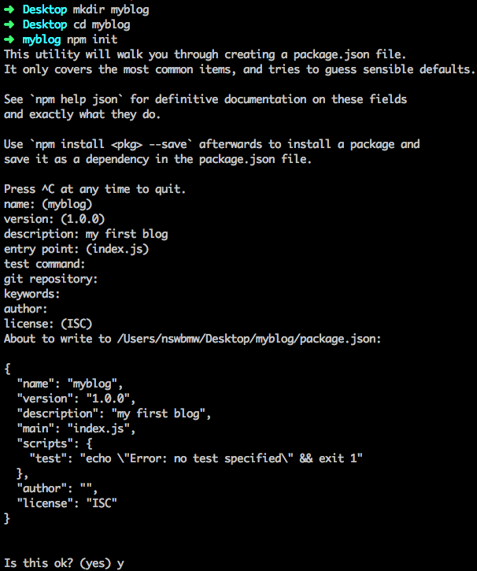

## 4.2.1 目录结构

我们停止 supervisor 并删除 myblog 目录从头来过。重新创建 myblog，运行 `npm init`，如下：



在 myblog 目录下创建以下目录及空文件（package.json 除外）：


对应文件及文件夹的用处：

1. `models`: 存放操作数据库的文件
2. `public`: 存放静态文件，如样式、图片等
3. `routes`: 存放路由文件
4. `views`: 存放模板文件
5. `index.js`: 程序主文件
6. `package.json`: 存储项目名、描述、作者、依赖等等信息

> 小提示：不知读者发现了没有，我们遵循了 MVC（模型(model)－视图(view)－控制器(controller/route)） 的开发模式。

## 4.2.2 安装依赖模块 

运行以下命令安装所需模块：

```sh
npm i config-lite connect-flash connect-mongo ejs express express-session marked moment mongolass objectid-to-timestamp sha1 winston express-winston --save
npm i https://github.com:utatti/express-formidable.git --save # 从 GitHub 安装 express-formidable 最新版，v1.0.0 有 bug
```

对应模块的用处：

1. `express`: web 框架
2. `express-session`: session 中间件
3. `connect-mongo`: 将 session 存储于 mongodb，结合 express-session 使用
4. `connect-flash`: 页面通知的中间件，基于 session 实现
5. `ejs`: 模板
6. `express-formidable`: 接收表单及文件上传的中间件
7. `config-lite`: 读取配置文件
8. `marked`: markdown 解析
9. `moment`: 时间格式化
10. `mongolass`: mongodb 驱动
11. `objectid-to-timestamp`: 根据 ObjectId 生成时间戳
12. `sha1`: sha1 加密，用于密码加密
13. `winston`: 日志
14. `express-winston`: express 的 winston 日志中间件

后面会详细讲解这些模块的用法。

## 4.2.3 ESLint

ESLint 是一个代码规范和语法错误检查工具。使用 ESLint 可以规范我们的代码书写，可以在编写代码期间就能发现一些低级错误。

ESLint 需要结合编辑器或 IDE 使用，如：

- Sublime Text 需要装两个插件：SublimeLinter + SublimeLinter-contrib-eslint
- VS Code 需要装一个插件：ESLint

> 小提示：Sublime Text 安装插件通过 ctrl+shift+p 调出 Package Control，输入 install 选择 Install Package 回车。输入对应插件名搜索，回车安装。
> 小提示：VS Code 安装插件需要点击左侧『扩展』页

全局安装 eslint：

```sh
npm i eslint -g
```

运行：

```sh
eslint --init
```

初始化 eslint 配置，依次选择：

-> Use a popular style guide  
-> Standard  
-> JSON

> 注意：如果 Windows 用户使用其他命令行工具无法上下切换选项，切换回 cmd。

eslint 会创建一个 .eslintrc.json 的配置文件，同时自动安装并添加相关的模块到 devDependencies。这里我们使用 Standard 规范，其主要特点是不加分号。

### 4.2.4 EditorConfig

EditorConfig 是一个保持缩进风格的一致的工具，当多人共同开发一个项目的时候，往往会出现每个人用不同编辑器的情况，而且有的人用 tab 缩进，有的人用 2 个空格缩进，有的人用 4 个空格缩进，EditorConfig 就是为了解决这个问题而诞生。

EditorConfig 需要结合编辑器或 IDE 使用，如：

- Sublime Text 需要装一个插件：EditorConfig
- VS Code 需要装一个插件：EditorConfig for VS Code

在 myblog 目录下新建 .editorconfig 的文件，添加如下内容：

```
# editorconfig.org
root = true

[*]
indent_style = space
indent_size = 2
end_of_line = lf
charset = utf-8
trim_trailing_whitespace = true
insert_final_newline = true
tab_width = 2

[*.md]
trim_trailing_whitespace = false

[Makefile]
indent_style = tab
```

这里我们使用 2 个空格缩进，tab 长度也是 2 个空格。trim_trailing_whitespace 用来删除每一行最后多余的空格，insert_final_newline 用来在代码最后插入一个空的换行。

上一节：[4.1 开发环境](https://github.com/nswbmw/N-blog/blob/master/book/4.1%20%E5%BC%80%E5%8F%91%E7%8E%AF%E5%A2%83.md)

下一节：[4.3 配置文件](https://github.com/nswbmw/N-blog/blob/master/book/4.3%20%E9%85%8D%E7%BD%AE%E6%96%87%E4%BB%B6.md)
